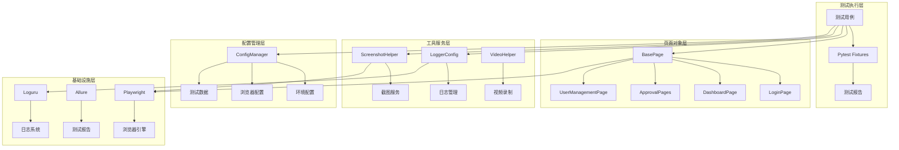
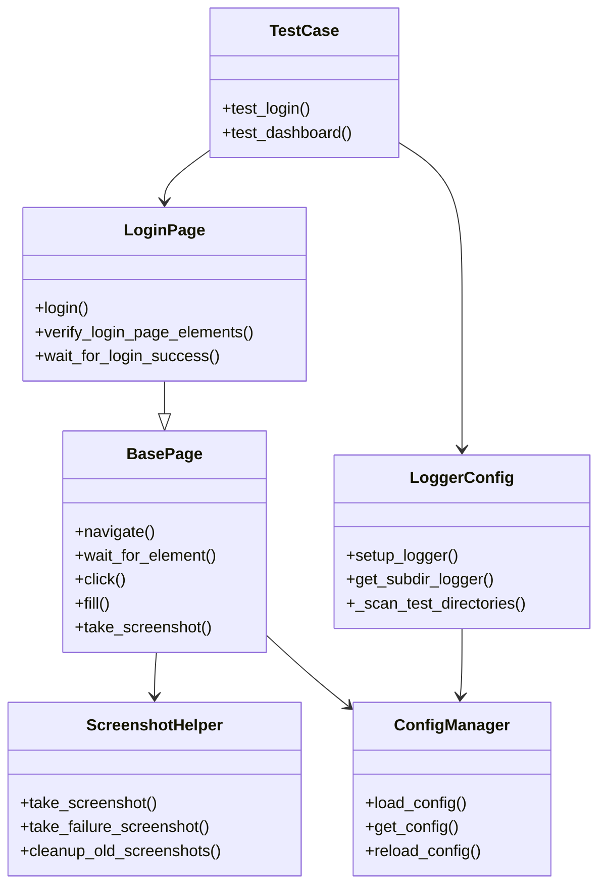

# Playwright 测试框架技术方案文档

## 1. 系统框架概述

### 1.1 整体架构设计

本Playwright测试框架采用分层架构设计，遵循页面对象模式（Page Object Model）和关注点分离原则，构建了一个高度模块化、可扩展的Web自动化测试解决方案。

#### 架构层次结构：

```
┌─────────────────────────────────────────────────────────────┐
│                    测试执行层 (Test Layer)                    │
├─────────────────────────────────────────────────────────────┤
│                   页面对象层 (Page Layer)                     │
├─────────────────────────────────────────────────────────────┤
│                   工具服务层 (Utils Layer)                    │
├─────────────────────────────────────────────────────────────┤
│                   配置管理层 (Config Layer)                   │
├─────────────────────────────────────────────────────────────┤
│                   基础设施层 (Infrastructure)                 │
└─────────────────────────────────────────────────────────────┘
```

### 1.2 系统整体架构图



### 1.3 各层级交互关系

#### 1.3.1 测试执行层
- **职责**：定义测试用例、管理测试生命周期、生成测试报告
- **组件**：测试类、Pytest Fixtures、Conftest配置
- **交互**：调用页面对象层进行UI操作，使用工具服务层记录日志和截图

#### 1.3.2 页面对象层
- **职责**：封装页面元素和操作、提供业务级别的API
- **组件**：BasePage基类、具体页面类
- **交互**：继承BasePage获得通用功能，调用Playwright API执行浏览器操作

#### 1.3.3 工具服务层
- **职责**：提供日志记录、截图、视频录制等辅助功能
- **组件**：LoggerConfig、ScreenshotHelper、VideoHelper
- **交互**：被测试执行层和页面对象层调用，依赖基础设施层的底层库

#### 1.3.4 配置管理层
- **职责**：管理环境配置、浏览器设置、测试数据
- **组件**：ConfigManager、环境配置文件
- **交互**：为所有上层提供配置信息，支持动态配置重载

#### 1.3.5 基础设施层
- **职责**：提供底层技术支持
- **组件**：Playwright、Allure、Loguru等第三方库
- **交互**：被上层组件调用，提供核心功能实现

### 1.4 核心模块组成结构

```
Playwright_Project/
├── config/                 # 配置管理模块
│   ├── env_config.py       # 环境配置管理
│   └── config.yaml         # 配置文件
├── pages/                  # 页面对象模块
│   ├── base_page.py        # 页面基类
│   ├── login_page.py       # 登录页面
│   ├── dashboard_page.py   # 仪表板页面
│   └── ...                 # 其他页面对象
├── tests/                  # 测试用例模块
│   ├── test_001/           # 测试套件1
│   ├── test_002/           # 测试套件2
│   └── test_003/           # 测试套件3
├── utils/                  # 工具服务模块
│   ├── logger_config.py    # 日志配置
│   ├── screenshot_helper.py # 截图助手
│   └── video_helper.py     # 视频助手
├── webapp/                 # 测试应用模块
│   ├── pages/              # HTML页面
│   ├── css/                # 样式文件
│   └── js/                 # JavaScript文件
└── conftest.py            # Pytest全局配置
```

## 2. 类与方法实现说明

### 2.1 核心类及其功能职责

#### 2.1.1 ConfigManager类
```python
class ConfigManager:
    """配置管理器 - 负责加载和管理系统配置"""
```
**功能职责**：
- 从YAML文件加载配置信息
- 提供配置项的动态访问接口
- 支持配置热重载
- 管理环境特定的配置

**关键方法**：
- `load_config()`: 加载配置文件
- `get_config()`: 获取配置项
- `reload_config()`: 重新加载配置
- `validate_config()`: 配置验证

#### 2.1.2 BasePage类
```python
class BasePage:
    """页面对象基类 - 提供通用的页面操作方法"""
```
**功能职责**：
- 封装Playwright基础操作
- 提供元素定位和操作方法
- 实现等待机制和异常处理
- 支持截图和日志记录

**关键方法**：
- `navigate()`: 页面导航
- `wait_for_element()`: 元素等待
- `click()`, `fill()`, `select()`: 基础操作
- `take_screenshot()`: 截图功能
- `handle_exception()`: 异常处理

#### 2.1.3 LoggerConfig类
```python
class LoggerConfig:
    """日志配置类 - 管理测试日志记录"""
```
**功能职责**：
- 配置Loguru日志系统
- 支持多级目录日志分离
- 实现日志去重和缓存
- 提供测试上下文日志记录

**关键方法**：
- `setup_logger()`: 初始化日志系统
- `get_subdir_logger()`: 获取子目录日志器
- `_scan_test_directories()`: 扫描测试目录
- `_create_subdir_filter()`: 创建目录过滤器

#### 2.1.4 ScreenshotHelper类
```python
class ScreenshotHelper:
    """截图助手类 - 提供多样化的截图功能"""
```
**功能职责**：
- 执行页面和元素截图
- 支持失败时自动截图
- 提供截图对比功能
- 管理截图文件生命周期

**关键方法**：
- `take_screenshot()`: 通用截图
- `take_failure_screenshot()`: 失败截图
- `take_element_screenshot()`: 元素截图
- `cleanup_old_screenshots()`: 清理旧截图

### 2.2 关键方法实现逻辑

#### 2.2.1 日志系统的二级目录支持
```python
def _scan_test_directories(self) -> None:
    """扫描tests目录下的所有子目录（支持二级目录）"""
    def scan_recursive(base_path: Path, relative_path: str = ""):
        for item in base_path.iterdir():
            if item.is_dir() and not item.name.startswith('__'):
                if relative_path:
                    subdir_key = f"{relative_path}/{item.name}"
                else:
                    subdir_key = item.name
                
                self._test_subdirs[subdir_key] = item
                log_subdir = self.log_dir / subdir_key.replace('/', '_')
                log_subdir.mkdir(exist_ok=True)
```

**实现逻辑**：
1. 递归扫描tests目录结构
2. 构建相对路径标识符
3. 创建对应的日志目录
4. 建立目录映射关系

#### 2.2.2 页面对象的智能等待机制
```python
def wait_for_element(self, selector: str, timeout: int = None, state: str = "visible") -> bool:
    """智能等待元素出现"""
    try:
        timeout = timeout or self.default_timeout
        self.page.wait_for_selector(selector, timeout=timeout, state=state)
        return True
    except TimeoutError:
        self.logger.warning(f"元素等待超时: {selector}")
        return False
```

**实现逻辑**：
1. 使用可配置的超时时间
2. 支持多种等待状态
3. 提供异常处理和日志记录
4. 返回布尔值便于条件判断

#### 2.2.3 配置管理的热重载机制
```python
def reload_config(self) -> bool:
    """重新加载配置文件"""
    try:
        old_config = self._config.copy()
        self._load_config_file()
        
        if self._config != old_config:
            self.logger.info("配置已更新并重新加载")
            return True
        return False
    except Exception as e:
        self.logger.error(f"配置重载失败: {e}")
        self._config = old_config
        return False
```

**实现逻辑**：
1. 备份当前配置
2. 尝试加载新配置
3. 比较配置变化
4. 异常时回滚配置

### 2.3 类之间的调用关系图



## 3. 系统优势分析

### 3.1 技术先进性

#### 3.1.1 现代化技术栈
- **Playwright引擎**：支持现代浏览器的最新特性，提供更稳定的自动化能力
- **异步架构**：基于异步编程模型，提高测试执行效率
- **跨浏览器支持**：原生支持Chrome、Firefox、Safari、Edge等主流浏览器
- **移动端适配**：内置移动设备模拟功能

#### 3.1.2 智能化特性
- **自动等待机制**：智能等待页面元素，减少不稳定的显式等待
- **网络拦截**：支持网络请求拦截和模拟，便于API测试
- **视频录制**：自动录制测试执行过程，便于问题诊断
- **并行执行**：支持多进程并行测试，大幅提升执行效率

### 3.2 系统性能优化点

#### 3.2.1 日志系统优化
```python
# 日志去重机制
def _should_log(self, message: str, level: str) -> bool:
    message_hash = hashlib.md5(f"{level}:{message}".encode()).hexdigest()
    current_time = time.time()
    
    if message_hash in self._log_cache:
        last_time = self._log_cache[message_hash]
        if current_time - last_time < self._dedup_window:
            return False
    
    self._log_cache[message_hash] = current_time
    return True
```

**优化效果**：
- 减少重复日志输出，提升日志可读性
- 降低磁盘I/O操作，提高性能
- 智能缓存管理，避免内存泄漏

#### 3.2.2 截图性能优化
```python
# 智能截图配置
screenshot_config = {
    'full_page': True,
    'type': 'png',
    'animations': 'disabled',  # 禁用动画提升性能
    'timeout': 30000
}

if quality < 100:
    screenshot_config['type'] = 'jpeg'
    screenshot_config['quality'] = str(quality)
```

**优化效果**：
- 根据质量要求选择最优图片格式
- 禁用动画减少截图时间
- 可配置的超时机制避免长时间等待

#### 3.2.3 配置缓存机制
```python
class ConfigManager:
    def __init__(self):
        self._config_cache = {}
        self._last_modified = {}
    
    def get_config(self, key: str):
        # 检查文件修改时间，实现智能缓存
        if self._is_config_modified():
            self.reload_config()
        return self._config_cache.get(key)
```

**优化效果**：
- 减少重复的文件读取操作
- 支持配置文件变更检测
- 提升配置访问性能

### 3.3 对比传统方案的改进之处

#### 3.3.1 相比Selenium的优势

| 特性 | Selenium | Playwright |
|------|----------|------------|
| 浏览器支持 | 需要驱动程序 | 内置浏览器引擎 |
| 等待机制 | 手动显式等待 | 智能自动等待 |
| 网络控制 | 有限支持 | 完整网络拦截 |
| 并行执行 | 复杂配置 | 原生支持 |
| 移动端测试 | 需要Appium | 内置设备模拟 |
| 调试能力 | 基础调试 | 丰富的调试工具 |

#### 3.3.2 相比传统框架的改进

**传统问题**：
- 测试不稳定，容易出现随机失败
- 配置复杂，维护成本高
- 缺乏统一的日志和报告机制
- 扩展性差，难以适应需求变化

**本框架改进**：
- 智能等待和重试机制提升稳定性
- 统一配置管理，简化维护工作
- 完整的日志和报告体系
- 模块化设计，易于扩展和定制

### 3.4 可扩展性和维护性优势

#### 3.4.1 模块化架构
```python
# 页面对象继承体系
class BasePage:
    """基础页面类，提供通用功能"""
    
class LoginPage(BasePage):
    """登录页面，继承基础功能并扩展特定操作"""
    
class DashboardPage(BasePage):
    """仪表板页面，复用基础功能"""
```

**优势**：
- 代码复用率高，减少重复开发
- 统一的接口规范，便于团队协作
- 易于添加新页面对象

#### 3.4.2 配置驱动设计
```yaml
# config.yaml
playwright:
  default_browser: "chromium"
  browser_config:
    headless: false
    viewport:
      width: 1280
      height: 720
  
test_config:
  timeout: 30000
  retry_count: 2
```

**优势**：
- 无需修改代码即可调整行为
- 支持多环境配置切换
- 便于CI/CD集成

#### 3.4.3 插件化扩展机制
```python
# 支持自定义插件
class CustomPlugin:
    def before_test(self, test_item):
        """测试前钩子"""
        pass
    
    def after_test(self, test_item, result):
        """测试后钩子"""
        pass
```

**优势**：
- 支持功能插件化扩展
- 不影响核心框架稳定性
- 便于集成第三方工具

## 4. 实施建议

### 4.1 最佳实践指导

#### 4.1.1 页面对象设计原则
```python
class GoodPageExample(BasePage):
    """良好的页面对象设计示例"""
    
    def __init__(self, page: Page):
        super().__init__(page)
        # 使用属性定义选择器
        self.username_input = "#username"
        self.password_input = "#password"
        self.login_button = "button[type='submit']"
    
    def login(self, username: str, password: str):
        """业务级别的方法，封装多个操作"""
        self.fill(self.username_input, username)
        self.fill(self.password_input, password)
        self.click(self.login_button)
        self.wait_for_login_success()
```

**最佳实践**：
- 使用描述性的选择器变量名
- 提供业务级别的方法
- 避免在测试用例中直接操作元素
- 实现适当的等待和验证

#### 4.1.2 测试用例组织结构
```python
class TestLogin:
    """登录功能测试类"""
    
    @pytest.fixture(autouse=True)
    def setup(self, page):
        """测试前置条件"""
        self.login_page = LoginPage(page)
        self.login_page.navigate()
    
    def test_valid_login(self):
        """有效登录测试"""
        self.login_page.login("admin", "password")
        assert self.login_page.is_login_successful()
    
    @pytest.mark.parametrize("username,password", [
        ("", "password"),
        ("admin", ""),
        ("invalid", "invalid")
    ])
    def test_invalid_login(self, username, password):
        """无效登录参数化测试"""
        self.login_page.login(username, password)
        assert self.login_page.has_error_message()
```

**最佳实践**：
- 使用类组织相关测试用例
- 利用fixture管理测试数据和环境
- 使用参数化测试覆盖多种场景
- 保持测试用例的独立性

#### 4.1.3 配置管理最佳实践
```yaml
# 环境特定配置
environments:
  dev:
    base_url: "http://localhost:8080"
    database_url: "localhost:5432"
  
  staging:
    base_url: "https://staging.example.com"
    database_url: "staging-db:5432"
  
  prod:
    base_url: "https://prod.example.com"
    database_url: "prod-db:5432"
```

**最佳实践**：
- 分离环境特定配置
- 使用环境变量覆盖敏感信息
- 提供合理的默认值
- 定期验证配置的有效性

### 4.2 常见问题解决方案

#### 4.2.1 元素定位不稳定
**问题**：页面元素定位经常失败

**解决方案**：
```python
def robust_click(self, selector: str, timeout: int = 30000):
    """健壮的点击操作"""
    try:
        # 1. 等待元素可见
        self.page.wait_for_selector(selector, state="visible", timeout=timeout)
        
        # 2. 滚动到元素位置
        element = self.page.locator(selector)
        element.scroll_into_view_if_needed()
        
        # 3. 等待元素可交互
        element.wait_for(state="attached")
        
        # 4. 执行点击
        element.click()
        
    except Exception as e:
        # 5. 失败时截图并重试
        self.take_screenshot(f"click_failed_{selector}")
        raise e
```

#### 4.2.2 测试数据管理
**问题**：测试数据难以维护和复用

**解决方案**：
```python
# test_data.py
class TestDataManager:
    """测试数据管理器"""
    
    @staticmethod
    def get_user_data(user_type: str) -> dict:
        """获取用户测试数据"""
        data_map = {
            "admin": {"username": "admin", "password": "admin123"},
            "user": {"username": "user1", "password": "user123"},
            "guest": {"username": "guest", "password": "guest123"}
        }
        return data_map.get(user_type, {})
    
    @staticmethod
    def generate_random_user() -> dict:
        """生成随机用户数据"""
        from faker import Faker
        fake = Faker('zh_CN')
        return {
            "username": fake.user_name(),
            "email": fake.email(),
            "phone": fake.phone_number()
        }
```

#### 4.2.3 并行测试冲突
**问题**：并行执行时测试之间相互影响

**解决方案**：
```python
# conftest.py
@pytest.fixture(scope="function")
def isolated_context(browser):
    """隔离的浏览器上下文"""
    context = browser.new_context(
        # 使用随机用户代理避免冲突
        user_agent=f"TestBot-{uuid.uuid4()}",
        # 独立的存储状态
        storage_state=None
    )
    yield context
    context.close()

# 使用数据库事务隔离
@pytest.fixture
def db_transaction():
    """数据库事务隔离"""
    transaction = db.begin()
    yield transaction
    transaction.rollback()
```

### 4.3 性能调优建议

#### 4.3.1 测试执行优化
```python
# pytest.ini
[tool:pytest]
addopts = 
    --numprocesses=auto          # 自动并行
    --maxfail=5                  # 快速失败
    --tb=short                   # 简化错误输出
    --strict-markers             # 严格标记模式
    --disable-warnings           # 禁用警告
```

#### 4.3.2 浏览器性能优化
```python
# 浏览器启动优化
browser_config = {
    "headless": True,                    # 无头模式
    "args": [
        "--no-sandbox",                  # 禁用沙箱
        "--disable-dev-shm-usage",       # 禁用/dev/shm
        "--disable-gpu",                 # 禁用GPU
        "--disable-web-security",        # 禁用Web安全
        "--disable-features=VizDisplayCompositor"
    ]
}
```

#### 4.3.3 资源管理优化
```python
class ResourceManager:
    """资源管理器"""
    
    def __init__(self):
        self.cleanup_tasks = []
    
    def register_cleanup(self, task):
        """注册清理任务"""
        self.cleanup_tasks.append(task)
    
    def cleanup_all(self):
        """执行所有清理任务"""
        for task in self.cleanup_tasks:
            try:
                task()
            except Exception as e:
                logger.warning(f"清理任务失败: {e}")
```

## 5. 未来演进方向

### 5.1 可能的扩展方案

#### 5.1.1 AI驱动的测试生成
```python
class AITestGenerator:
    """AI测试生成器"""
    
    def analyze_page_structure(self, page_url: str) -> dict:
        """分析页面结构，生成测试建议"""
        # 使用机器学习分析页面元素
        # 识别可测试的交互元素
        # 生成测试用例模板
        pass
    
    def generate_test_cases(self, page_analysis: dict) -> list:
        """基于页面分析生成测试用例"""
        # 自动生成边界值测试
        # 生成异常场景测试
        # 创建性能测试用例
        pass
```

#### 5.1.2 云端测试执行平台
```python
class CloudTestRunner:
    """云端测试执行器"""
    
    def submit_test_job(self, test_suite: str, config: dict) -> str:
        """提交测试任务到云端"""
        # 支持多云平台执行
        # 自动资源调度
        # 实时监控和报告
        pass
    
    def get_test_results(self, job_id: str) -> dict:
        """获取云端测试结果"""
        # 实时结果同步
        # 多维度测试报告
        # 性能指标分析
        pass
```

#### 5.1.3 智能测试维护
```python
class SmartTestMaintainer:
    """智能测试维护器"""
    
    def detect_flaky_tests(self, test_history: list) -> list:
        """检测不稳定的测试"""
        # 分析测试历史数据
        # 识别随机失败模式
        # 提供修复建议
        pass
    
    def auto_update_selectors(self, page_changes: dict) -> dict:
        """自动更新选择器"""
        # 检测页面变化
        # 智能匹配新元素
        # 自动更新页面对象
        pass
```

### 5.2 技术升级路径

#### 5.2.1 短期升级（3-6个月）
1. **增强报告系统**
   - 集成更多测试指标
   - 添加趋势分析功能
   - 支持自定义报告模板

2. **扩展API测试能力**
   - 集成REST API测试
   - 支持GraphQL测试
   - 添加性能测试功能

3. **改进CI/CD集成**
   - 支持更多CI平台
   - 优化构建时间
   - 增强失败通知机制

#### 5.2.2 中期升级（6-12个月）
1. **引入容器化测试**
   ```dockerfile
   # Dockerfile for test execution
   FROM mcr.microsoft.com/playwright:focal
   
   WORKDIR /app
   COPY requirements.txt .
   RUN pip install -r requirements.txt
   
   COPY . .
   CMD ["pytest", "--numprocesses=auto"]
   ```

2. **实现测试数据管理平台**
   - 中央化测试数据存储
   - 数据版本控制
   - 自动数据清理机制

3. **添加可视化测试**
   - 页面截图对比
   - 视觉回归测试
   - 跨浏览器一致性检查

#### 5.2.3 长期升级（1-2年）
1. **机器学习集成**
   - 智能测试用例生成
   - 自动化缺陷预测
   - 测试优先级智能排序

2. **微服务测试架构**
   - 分布式测试执行
   - 服务间测试协调
   - 容错和自愈能力

3. **低代码测试平台**
   - 可视化测试编辑器
   - 拖拽式测试构建
   - 业务人员友好界面

### 5.3 功能增强方向

#### 5.3.1 测试覆盖率增强
```python
class CoverageAnalyzer:
    """测试覆盖率分析器"""
    
    def analyze_code_coverage(self) -> dict:
        """分析代码覆盖率"""
        # 集成代码覆盖率工具
        # 生成覆盖率报告
        # 识别未测试代码
        pass
    
    def analyze_ui_coverage(self) -> dict:
        """分析UI覆盖率"""
        # 检测页面元素覆盖
        # 分析用户路径覆盖
        # 生成覆盖率热图
        pass
```

#### 5.3.2 性能测试集成
```python
class PerformanceTestSuite:
    """性能测试套件"""
    
    def load_test(self, url: str, concurrent_users: int) -> dict:
        """负载测试"""
        # 模拟并发用户
        # 监控响应时间
        # 分析性能瓶颈
        pass
    
    def stress_test(self, url: str, max_load: int) -> dict:
        """压力测试"""
        # 逐步增加负载
        # 找到系统极限
        # 评估稳定性
        pass
```

#### 5.3.3 安全测试能力
```python
class SecurityTestSuite:
    """安全测试套件"""
    
    def xss_test(self, input_fields: list) -> dict:
        """XSS漏洞测试"""
        # 注入恶意脚本
        # 检测过滤机制
        # 生成安全报告
        pass
    
    def sql_injection_test(self, forms: list) -> dict:
        """SQL注入测试"""
        # 尝试SQL注入攻击
        # 验证输入验证
        # 评估安全风险
        pass
```

## 6. 总结

本Playwright测试框架通过现代化的技术栈和精心设计的架构，为Web应用测试提供了一个高效、稳定、可扩展的解决方案。框架的核心优势包括：

1. **技术先进性**：基于Playwright引擎，支持现代浏览器特性
2. **架构合理性**：分层设计，职责清晰，易于维护
3. **功能完整性**：涵盖UI测试、日志记录、报告生成等全流程
4. **扩展灵活性**：模块化设计，支持插件化扩展
5. **性能优越性**：智能优化机制，提升测试执行效率

通过持续的技术演进和功能增强，该框架将能够适应不断变化的测试需求，为团队提供长期稳定的测试自动化支持。

---

*本文档版本：v1.0*  
*最后更新：2024年*  
*文档维护：测试团队*